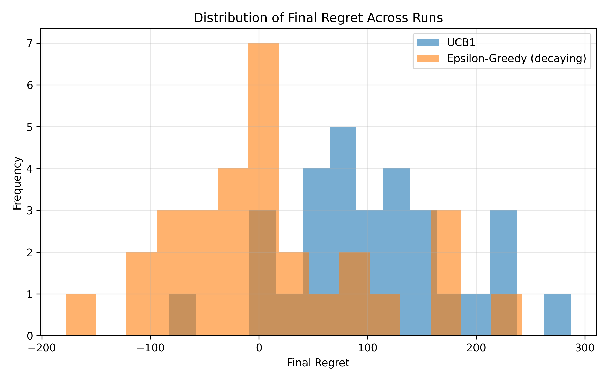

# Adaptive LLM Evaluation via Multi-Armed Bandits

## Overview

LLM evaluation pipelines are inefficient because they allocate testing effort uniformly across prompt categories, regardless of where failures actually occur.

Most evaluation pipelines rely on static test sets or uniform sampling, allocating equal effort across all prompt categories. This leads to wasted evaluation budget, slow failure discovery, and poor coverage of model weaknesses.

This work frames LLM evaluation as a **resource allocation problem**.

> This repository implements the **evaluation strategy layer**, not a full LLM evaluation pipeline.

Instead of uniformly sampling prompts, it dynamically prioritizes high-risk regions using multi-armed bandit strategies, improving failure discovery efficiency under fixed evaluation budgets.

This work focuses on the evaluation strategy component, decoupled from prompt generation, model execution, and scoring infrastructure.

---

## Approach

We model evaluation as a multi-armed bandit problem:

- Each prompt category → an arm  
- Each evaluation → a pull  
- Reward → failure detection (1 if failure, 0 otherwise)

**Objective:**

> Maximize failure discovery efficiency while minimizing evaluation cost.

---

## Algorithms

- **UCB1 (Upper Confidence Bound)**
- **Epsilon-Greedy (decaying exploration)**

Both algorithms are evaluated under identical stochastic conditions.

---

## Experimental Setup

- Arms: 2 (failure probabilities: 0.45, 0.55)  
- Horizon: 20,000 plays per run  
- Trials: 30 independent runs  
- Reproducibility: fixed and incremented random seeds  

### Metrics

- Cumulative regret (mean ± standard error)  
- Fraction of optimal arm selection  
- Statistical validation via paired t-test  

---

## Results



Decaying ε-Greedy significantly outperforms UCB1 under identical conditions.

- UCB1 final regret: ~104.4  
- Epsilon-Greedy final regret: ~12.4  
- p-value (paired t-test): ~0.00116  

This indicates a consistent and repeatable performance advantage of adaptive exploration, resulting in ~8× lower regret and faster identification of model weaknesses.

---

## Key Insight

Evaluation should not treat all prompts equally.

Adaptive strategies concentrate evaluation effort on failure-prone regions, improving sample efficiency without increasing total evaluation volume.

This reframes LLM evaluation as a resource allocation problem, where evaluation budget is dynamically directed toward high-risk regions instead of uniformly distributed.

---

## Repository Structure

```text
llm-eval-bandit/
│
├── analysis.py              # Core algorithms and experiment logic
├── README.md
├── requirements.txt
│
├── notebooks/
│   └── analysis.ipynb       # Exploratory analysis and visualization
│
├── scripts/
│   ├── run_experiment.py    # CLI entrypoint (runs experiments)
│   └── plot_results.py      # Generates plots from saved results
│
└── results/                 # Output artifacts (generated)
```

---

## How to Run

### 1. Install dependencies

```bash
pip install -r requirements.txt
```

### 2. Run experiment

```bash
python -m scripts.run_experiment
```

**This will generate:**
* **Summary CSV** (mean regret)
* **Raw result arrays** (`.npy`)

### 3. Generate plots

```bash
python -m scripts.plot_results
```

**This produces:**
* **Distribution of final regret** across runs (histogram)

---

## Outputs

> **Note:** > Example outputs (plots and summary CSV) are included for reference. Full results can be reproduced using the provided scripts.

Results are stored in:
`results/`

**Artifacts include:**
* `.npy` — Raw per-run results (for reproducibility and analysis)
* `.csv` — Summary metrics
* `.png` — Visualizations

*Note: Raw outputs are preserved to enable recomputation of statistics and flexible downstream analysis.*

---

## Limitations

* **Simplified environment:** Restricted to 2 arms.
* **Static rewards:** Fixed reward distributions.
* **No LLM integration:** Lacks real-time LLM API calls.
* **Static prompts:** No dynamic prompt generation logic.

This implementation serves as a controlled baseline for evaluating adaptive sampling strategies.

---

## Future Work

* **API Integration:** Connect with live LLM providers.
* **Multi-category evaluation:** Scale to $K > 2$.
* **Contextual Bandits:** Implement feature-based decision making.
* **Automated Scoring:** Integrated failure scoring pipelines.

---

## Why This Matters

Evaluation cost is a bottleneck in production LLM systems.

This approach enables:

- Faster discovery of model failures  
- More efficient safety and robustness testing  
- Reduced evaluation overhead in continuous deployment pipelines  

It can serve as a **drop-in strategy layer** for:

- Model auditing pipelines  
- Safety evaluation workflows  
- Continuous evaluation systems  

---

## Summary

This project provides a minimal, reproducible evaluation system that:
* Models evaluation as a **multi-armed bandit problem**.
* **Validates results** through statistical rigor.
* **Decouples** computation, execution, and visualization.

It functions as a clean evaluation primitive designed for extension into production-grade workflows.
